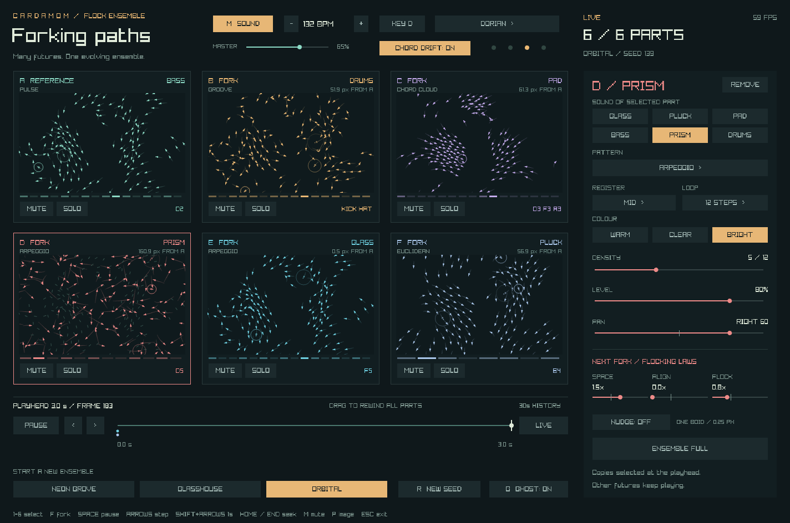

# Forking paths

A flock ensemble with **six simultaneous parts**: a reference world and up to five
independent forks. Each world plays its own instrument. Rewind, change a flocking
law, fork a fork, and hear their melodies grow apart on a shared musical clock.



## Run

From the repository root:

```sh
python3 scripts/forks.py                     # Neon Grove: four instruments
python3 scripts/forks.py --scene glasshouse  # spacious three-part arrangement
python3 scripts/forks.py --scene orbital     # all six instruments
```

The helper reuses the boids demo's cached raylib 5.5 build under `target/boids/`.
It needs Python 3, Cargo, a C++ compiler, Git, and CMake. See the
[boids setup instructions](README.md#run) for macOS/Linux prerequisites and
`--raylib-prefix` / `RAYLIB_PREFIX` support. Nothing is installed system-wide.

Sound starts at 70% master volume. Press **M** to mute, or use `--silent` to skip
opening an audio device. If audio initialization fails, the visual experiment
still runs. All six instruments are synthesized locally; no sound assets are needed.

## Start making music

1. Start **Neon Grove** and listen to its glass arpeggio, bass pulse, pad chords,
   and drum groove.
2. Click a part, or press **1–6**, to select it. The editor on the right changes
   that part's instrument, pattern, register, tone, density, level, and pan.
3. Click an empty tile or press **F** to copy the selected flock into another
   part. The new part receives an unused instrument; the existing futures remain.
4. Try a **12-step** pluck against **16-step** drums and an **8-step** glass part.
   Their rhythms meet at different points while sharing the same tempo.
5. Use **SOLO** to hear one part or a combination, then shape the balance with
   **LEVEL** and **PAN**. Multiple parts can use the same instrument.

Changing instruments keeps the flock's motion. Changing **NEXT FORK** prepares
the physics of a new part: **SPACE** controls separation, **ALIGN** controls
alignment, and **FLOCK** controls cohesion. Their 0.0–3.0 multipliers start from the
selected world's laws. **NUDGE** moves one boid by 0.25 pixels when the fork is
created. Press F to apply these choices to a new fork.

For an experiment, rewind a few seconds, select A, lower ALIGN, and add a fork.
A retains its recorded future. The new part grows from the playhead and can join
the ensemble with a different instrument. Select that fork and press F again to
branch from its state. **REMOVE** frees the selected fork's slot; any children
keep their own histories. A is always retained.

## Ensemble presets

The three buttons at the bottom start a fresh ensemble using the current seed.
They replace the current parts and history.

| Preset | Parts | Clock | Arrangement |
| --- | --- | --- | --- |
| **Neon Grove** | 4 | 120 BPM, D minor pentatonic | Glass arpeggio, bass pulse, pad chords, kick/snare/hat groove |
| **Glasshouse** | 3 | 90 BPM, C major pentatonic | Encounter-driven glass, a 12-step pluck, warm pad chords |
| **Orbital** | 6 | 132 BPM, D Dorian | Bass and drums, pads, bright FM, high glass, and an 8-step pluck |

All presets enable **CHORD DRIFT**: the harmonic centre moves through four scale
degrees, changing every two bars. Turn it off to hold the root. The shared key,
scale, and tempo controls also work while playing. Scales are minor pentatonic,
major pentatonic, Dorian, and whole tone; tempo ranges from 60 to 180 BPM.

## Shape each part

| Instrument | Character |
| --- | --- |
| **Glass** | Bell-like tones with shimmering overtones |
| **Pluck** | Short, rounded string-like notes |
| **Pad** | Slow attacks and a softly detuned sustained tone |
| **Bass** | Low tones with a quick decay |
| **Prism** | FM tones that move from mellow to metallic |
| **Drums** | Synthesized kick, snare, and hi-hat |

**WARM / CLEAR / BRIGHT** changes the instrument's timbre. **LOW / MID / HIGH**
shifts pitched instruments by an octave. Drums keep their kick, snare, and hat
voices regardless of register.

The pattern button cycles through six ways to turn a flock into a phrase:

| Pattern | Behaviour |
| --- | --- |
| **Encounters** | The boid with the strongest neighbour change plays on eligible steps |
| **Arpeggio** | An ascending and descending phrase, with register influenced by height |
| **Euclidean** | Evenly distributed pulses, with pitches drawn from flock positions |
| **Chord Cloud** | Three-note chords on eligible quarter-note steps |
| **Pulse** | A steady two-note phrase for bass or another instrument |
| **Groove** | A backbeat with kick, snare, and hats; pitched instruments can use it too |

**DENSITY** sets how many steps are eligible in an 8-, 12-, or 16-step loop.
Encounters still need a neighbour change; chord clouds play on quarter notes.
For Groove, density adds the snare, hats, and then extra kicks and faster hats.
The flock's height and speed influence pitch and dynamics. Neighbour distances
wrap across the world's edges.

Each part has its own level, stereo pan, mute, and solo. Level and pan changes
also affect notes already ringing. Muting a soloed part silences it; other solos
remain audible. The mix allows six simultaneous notes per part, balances levels
across enabled parts, and gently limits high peaks. Muting or soloing does not
automatically boost the remaining parts.

## Transport and controls

| Input | Action |
| --- | --- |
| Click a part / 1–6 | Select an existing part for sound editing and forking |
| Empty tile / F / Fork Selected | Add a fork of the selected world at the playhead, then play |
| Remove / Delete | Remove the selected fork; retain its children |
| Space / Play or Pause | Pause or resume all parts |
| Drag the timeline | Seek through retained history and pause |
| Left / right arrow, or < / > | Step backward / forward one frame, silently |
| Shift + left / right arrow | Step one second backward / forward |
| Home | Jump to the oldest retained frame and pause |
| End / Live | Jump to the latest recorded frame and resume |
| M / Sound | Mute or unmute the entire ensemble |
| Per-part Mute / Solo | Mix individual parts or groups |
| G / Ghost | Overlay A's positions in each fork |
| R / New Seed | Restart all enabled parts at zero with a new seed, retaining their settings and laws |
| P | Save `target/boids/forks-preview.png` when launched with the helper |
| Escape | Close the window |

A coloured ring marks a boid playing a note; pitch labels show the latest notes.
They still animate while muted. Trails and the reference ghost help compare
trajectories. Each fork shows its mean distance from matching boids in A, using
the shortest distance across the wrapping edges.

## What rewind preserves

Every enabled world runs at a fixed 60 simulation steps per second and retains
up to 1,801 position/velocity snapshots: **30 seconds**. With six 144-boid worlds,
the snapshot data uses about 24 MiB. Storage stays bounded as the session grows.

Adding a fork preserves every other recorded future. When a new fork starts in
the past, playback or seeking generates its missing future as needed. A part is
absent and silent before its birth; it cannot be forked there. Removing a part
releases only its history.

Sound settings interpret the recorded physics live. With the same settings,
rewinding reproduces the same note events. It does not restore earlier instrument
edits or already-ringing note tails. Pausing, seeking, and stepping stop existing
voices; resuming starts at the next rhythmic boundary. Closing the app clears the
session; there is no session save/load format. Exact snapshot replay is local to
the session; floating-point results can differ between native toolchains.

## Render an audio preview

```sh
python3 scripts/forks.py --render-audio --scene orbital
```

This writes `target/boids/forks-music.wav`: **eight bars plus a two-second release**
of the chosen preset with seed 42. It uses the same composer, synthesis, voice
limits, stereo pan, output limiting, and 70% master volume as the app, without
raylib, a window, or an audio device. It renders a preset, not the currently open
session. Later renders replace that file.

## Build and verify

```sh
python3 scripts/forks.py --build-only
python3 scripts/forks.py --check
python3 scripts/forks.py --smoke
python3 scripts/forks.py --smoke --silent
cargo test
```

The headless checks cover independent histories, nested forks, removal, replay,
tempo, patterns, instruments, tone, presets, and mixing. The 300-frame smoke run
uses real raylib controls to edit sounds, add/remove forks, rewind, mix parts,
and switch presets; it checks the results and saves a screenshot. With audio
available it also checks sound loading, bounded voices, cache eviction, live
mixing, output limiting, isolation, and transport silence. Both smoke modes require a desktop
and OpenGL context. `--frames` can extend the smoke run beyond 300 frames.

The executable is `target/boids/forks`; generated C++ is retained beside it.
When launched directly, P saves `forks.png` in the working directory.

## Explore the code

- [forks.crdm](forks.crdm): input controller and fixed simulation clock.
- [timeline/main.crdm](timeline/main.crdm): six independent histories, lazy replay,
  fork creation/removal, and distance measurements.
- [arrangement/main.crdm](arrangement/main.crdm): presets, part settings, shared
  clock, and mix rules. Edit the preset functions here to create new arrangements.
- [composer/main.crdm](composer/main.crdm): deterministic notes, patterns, and PCM synthesis.
- [music/main.crdm](music/main.crdm): bounded instrument caches, playback, and audio lifetime.
- [forkview/main.crdm](forkview/main.crdm): six-part overview and instrument editor.
- [flock.crdm](flock.crdm): shared flocking model with adjustable law multipliers.
- [music_render.crdm](music_render.crdm): offline ensemble performance and WAV writer.
- [forks_check.crdm](forks_check.crdm), [music_check.crdm](music_check.crdm), and
  [forksmoke/main.crdm](forksmoke/main.crdm): simulation, score, and native UI checks.

Flock snapshots use flat arrays for compact, copied histories. The timeline and
arrangement modules document their state layouts.
