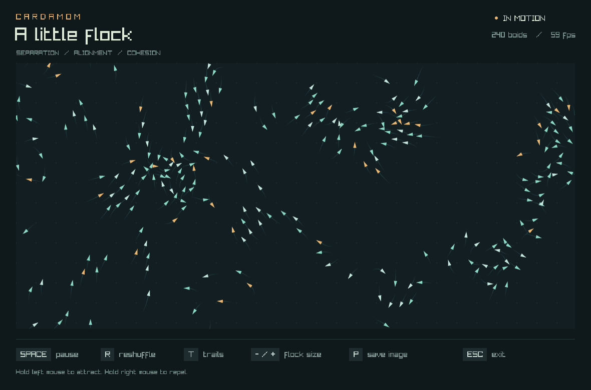

# A little flock

A native boids demo written in Cardamom, with a small raylib binding. Each boid
separates from nearby neighbours, aligns with their heading, and steers towards
their centre. The world wraps, so neighbours interact across the edges too.



For a time-travel experiment built on this flock, try [Forking paths](FORKS.md):
rewind a world, change its laws, and build a six-part musical ensemble with
`python3 scripts/forks.py`. Each fork can play its own instrument and rhythm,
with tone, register, loop, density, level, pan, mute, and solo controls. Try
`--scene orbital` for all six instruments, or start with Neon Grove or Glasshouse.

## Run

From the repository root:

```sh
python3 scripts/boids.py
```

You need Python 3, Rust/Cargo, a C++ compiler, Git, and CMake. On macOS, install the
Xcode command line tools and CMake if needed:

```sh
xcode-select --install
brew install cmake
```

The helper builds Cardamom, downloads raylib **5.5** at commit
`c1ab645ca298a2801097931d1079b10ff7eb9df8`, builds a static library, and opens the
demo. All build products and the raylib checkout stay under `target/`; it does not
install anything system-wide. The first run needs internet access. Later runs
reuse the native library.

On Linux, the helper builds the X11 desktop backend. Install CMake and the OpenGL,
X11, Xrandr, Xinerama, Xcursor, and Xi development packages first. For Debian/Ubuntu:

```sh
sudo apt install build-essential cmake git python3 libgl1-mesa-dev libx11-dev libxrandr-dev libxinerama-dev libxcursor-dev libxi-dev
```

To use raylib you already installed, supply a prefix containing `include/raylib.h`
and `lib/libraylib`:

```sh
python3 scripts/boids.py --raylib-prefix /path/to/raylib
```

`RAYLIB_PREFIX` is also recognised. `--cxx clang++` or `CXX=clang++` selects the C++
compiler. `CXX` names an executable; extra compiler arguments belong after `--`
when invoking Cardamom directly.

## Controls

| Input | Action |
| --- | --- |
| Hold left mouse button inside the field | Attract the flock |
| Hold right mouse button inside the field | Repel the flock |
| Space | Pause / resume |
| R | Reshuffle the flock |
| T | Toggle trails |
| - / + (the `=` key also works) | Remove / add 40 boids, from 40 to 600 |
| P | Save `target/boids/preview.png` when launched with the helper |
| Escape | Close the window |

## Build and check separately

```sh
# Compile, keeping generated C++ at target/boids/boids.cpp.
python3 scripts/boids.py --build-only
./target/boids/boids

# Deterministic simulation checks. No raylib, CMake, or display required.
python3 scripts/boids.py --check

# Open a real window for 180 frames, save preview.png, then exit.
python3 scripts/boids.py --smoke

# Compiler regressions, CLI/native-linking checks, and the same simulation checks.
cargo test
```

Running the executable directly saves screenshots to `boids.png` in the working
directory. The helper chooses `target/boids/preview.png` instead. A smoke run needs
a working desktop/OpenGL context, just like the interactive demo.

## How it fits together

- [main.crdm](main.crdm): the window, controls, fixed simulation timestep, trails,
  and drawing. It runs the simulation at 60 steps per second and caps catch-up
  time after a slow frame.
- [flock.crdm](flock.crdm): deterministic initialisation and flocking, with no
  graphics dependency. Positions and velocities occupy four floats per boid.
  Every update reads a stable input snapshot and writes a separate output buffer.
- [check.crdm](check.crdm): behavioural checks for wrapping, separation,
  alignment, mouse forces, repeatable seeding, and bounds over 600 steps.
- [runtime.crdm](runtime.crdm): the environment lookup used for the smoke frame
  limit and screenshot path.
- [std/raylib](../../std/raylib/main.crdm): optional functions for windows, timing,
  drawing, input, and screenshots. Native calls live in small `@cpp` bodies.

The simulation compares every boid with every other boid, so its work grows with
the square of the flock size. The demo caps the flock at 600. A spatial grid would
be the next useful change for substantially larger flocks.

## Use the binding in another program

```cpp
import raylib as gfx;

fn main() {
    gfx.initWindow(640, 480, "Hello from Cardamom");
    gfx.setTargetFPS(60);
    while (gfx.windowShouldClose() == 0) {
        gfx.beginDrawing();
        gfx.clearBackground(gfx.rgb(15, 24, 27));
        gfx.drawCircle(320.0, 240.0, 60.0, gfx.rgb(140, 218, 197));
        gfx.endDrawing();
    }
    gfx.closeWindow();
}
```

Colours are packed 24-bit RGB values created with `gfx.rgb(r, g, b)` (channels
0–255). Keyboard and mouse functions accept raylib's integer codes; letters use
uppercase ASCII codes, space is 32, and mouse buttons 0/1 are left/right.
Predicates in this binding return integers 0/1, which remain compatible with
Cardamom's native `bool` values.

Compile with your installation's include, library, and platform linker flags
after `--`. For example, using the helper's static build on macOS:

```sh
./target/release/cardamom app.crdm -o target/app -- -O2 \
  -I target/boids/raylib-5.5/include -L target/boids/raylib-5.5/lib -lraylib \
  -framework Cocoa -framework IOKit -framework CoreVideo -framework OpenGL \
  -framework CoreAudio -framework AudioToolbox
```

Importing `raylib` adds only the functions actually called. Programs that do not
use its native functions do not need its headers or libraries.
